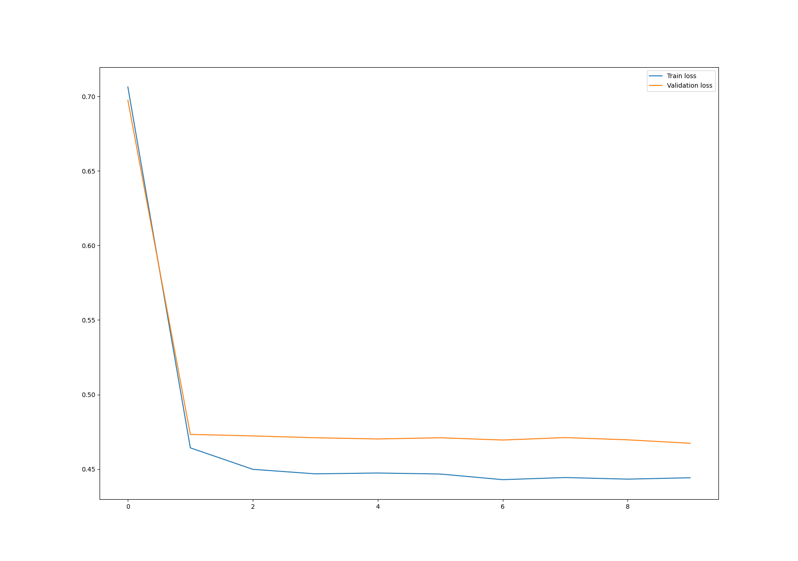
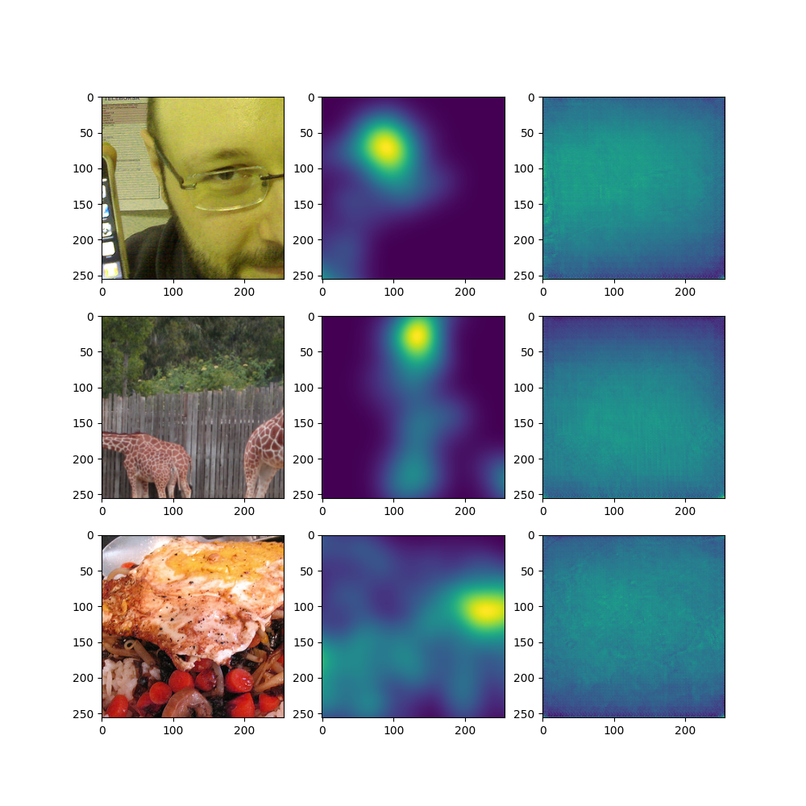
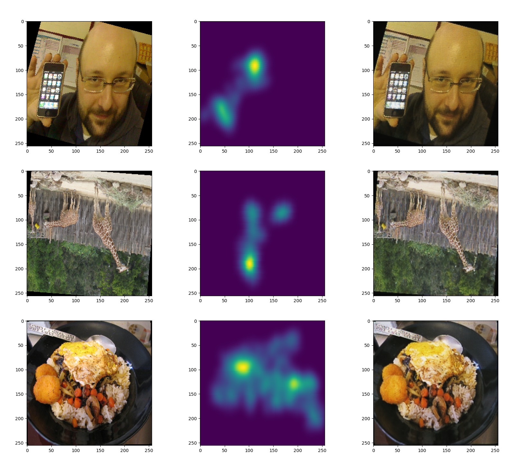
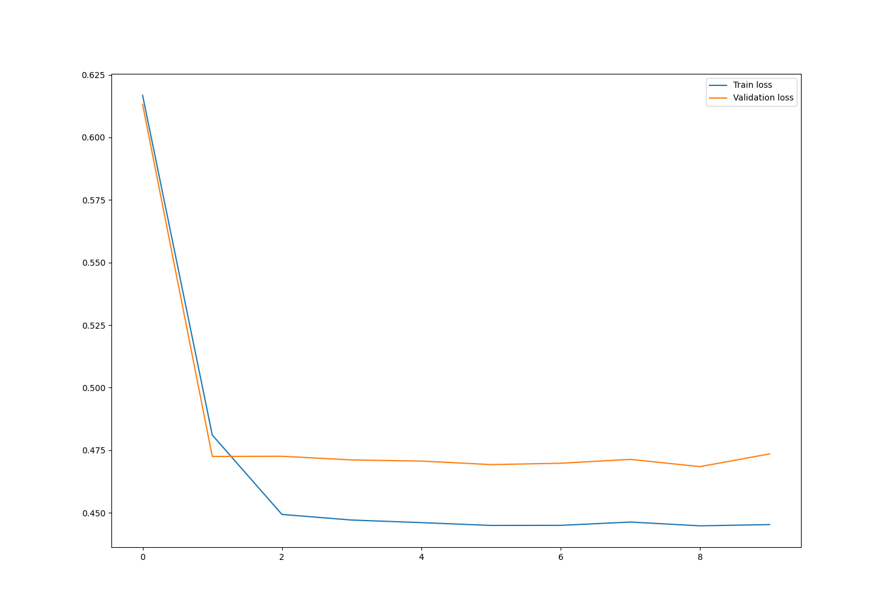
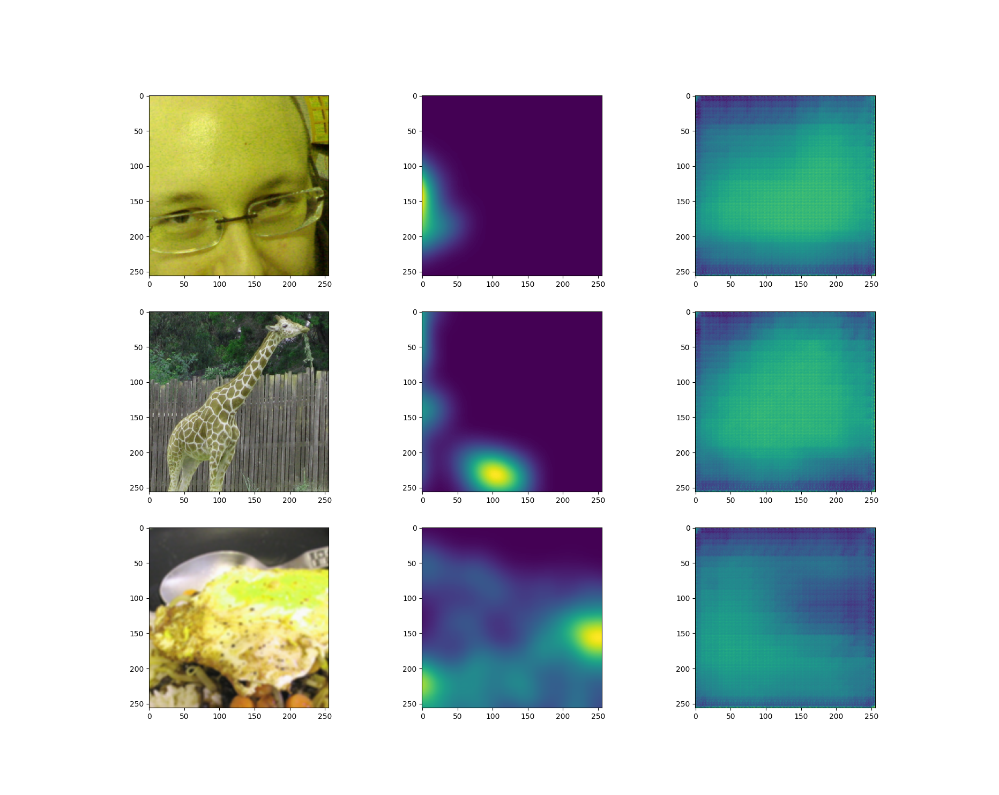

## U-Net

### Introduction

The first idea was to use U-Net, as it was shown that U-Net-like models are capable of performing saliency prediction[1].

Our implementation differed than the one proposed by the SATSal paper, as we iterated through different configurations. 

U-Net training on the SALICON dataset can be performed by runnig the following command in the `unet` directory:

`python3 train_salicon.py`

Dataset, needed for training, can be downloaded from [here](http://salicon.net/challenge-2017/).

tl;dr: It failed, miserably. 

### Folder structure

The `unet` directory contains the following files:
* `train_salicon.py` -- the main file for training the model
* `encoder.py` -- containing definition of an encoder block, meant to perform dilated convolutions on its input and downsample it later on, using resnet-like architecture
* `decoder.py` -- as above, but performing upsampling 
* `unet.py` -- the U-Net model definition; different configurations were tried.
*  `salicon_dataset.py` -- a dataset class for loading the SALICON dataset
* `visualise_model_outputs.py` -- script meant to show model's answers on a few images from the dataset's validation set 
* `evaluate_salicon.py` -- contains definition of a function for evaluating the model 
* `salicon_model.pt` -- pretrained model weights
* `convo_attention.py` -- a simple convolutional attention mechanism, meant to be used in the U-Net model

### Approaches 

First, we've tried a very simple U-Net wit 2 skip connections, containing 3 encoder blocks and 3 decoder blocks. Optimiser was Adam; lr 1e-3; batch size 64; loss was binary cross-entropy. After the first few epochs, the model was converging with bad results. This prompted us to add more encoders (and decoders) to improve the model's complexity and combat underfit. Despite different augmentation strategies, this has failed miserably:

Model's loss (BCE).

(From left to right) Input image, ground truth, model's output.

It is very important to note, that the task at hand was simpler than it was meant to be, as we were not masking images (which was one of main points of our project).

We've experimented with different augmentation strategies, but to no avail. For example, we've decided to only rescale images instead of performing random crops, but then the center bias of the dataset caused the model to predict only the center of the image as salient.

To verify that learning mechanism is working properly and the model has capacity to learn *something*, we've made it learn identity function (which is trivial for a U-Net). The model was able to learn it without any issues:

(From left to right) Input image, saliency ground truth, model's output (meant to replicate its input); images from the validation set.

This has prompted us to add more complexity to the model by implementing a simple convolutional attention, which is similar to the one used in the SATSal paper (although it is downsampling the image, not reducing the number of channels). While the performance seemed to be slightly better, ultimately it was still absolutely useless:

For training of the model with attention, we've used learning rate equal 1e-4. 

It seems like making U-Net able to learn on the SALICON dataset is harder task than we've anticipated. 

Given results that MAE-like models yield, there is probably no point in investigating this approach further, although it is definitely possible to train a U-Net that works reasonably well on the SALICON (althoug we would still need to mask images, which would make the task harder).

### Open questions
* Could changing the loss function to a more complex one (like the one used in the SATSal paper, making use of the KLD) improve the results?
* Other augmentation strategies?
* Adding results from skip connections, instead of concatenating them?
* Cross attention with results from skip connections instead of concatenating them?
* More channels in the model?

## Sources

[1] Tliba, Marouane & Kerkouri, Mohamed & Ghariba, Bashir & Chetouani, Aladine & Coltekin, Arzu & Shehata, Mohamed & Bruno, Alessandro. (2022). SATSal: A Multi-level Self-Attention Based Architecture for Visual Saliency Prediction. IEEE Access. 10. 1-1. 10.1109/ACCESS.2022.3152189. 