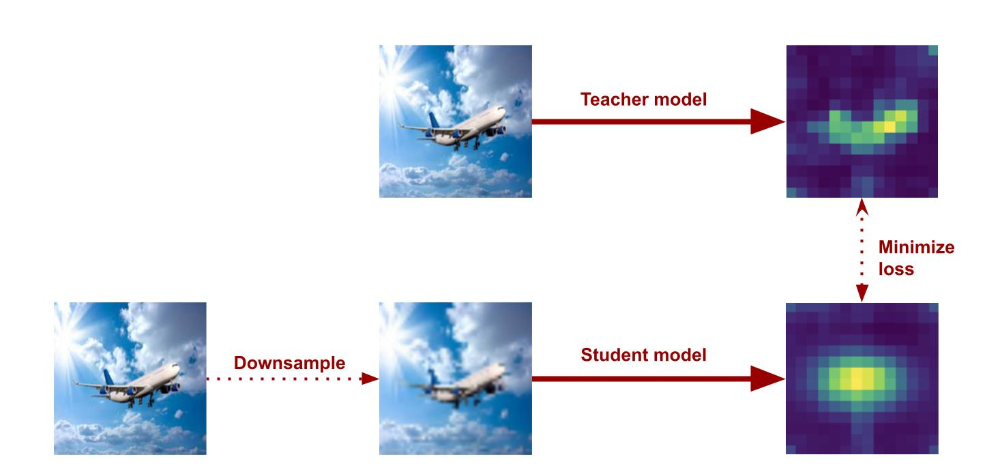
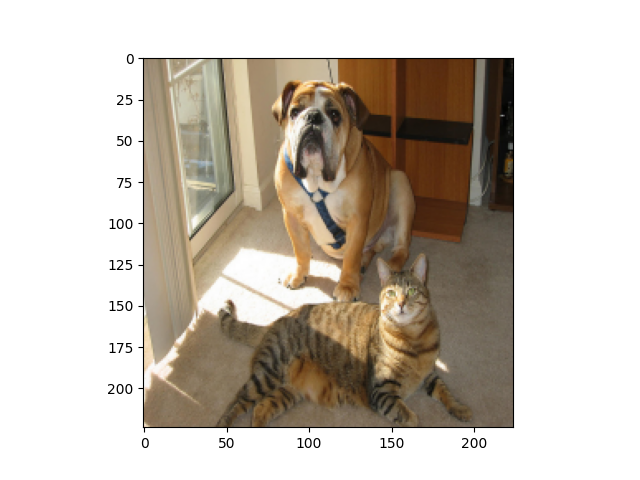

# Masked image saliency map prediction

### Approach 3: Basic attention rollout and convnet student

*Code availabe [here](https://github.com/kacpermarzol/Pattern-recognition-project-basic-rollout-convnet")*

We want to try a convolutional neural network (ResNet) as a student for a visual transformer teacher. The plan was to downsample
the image for studnet model and make it learn the attention from the teacher model (which uses the full image):

For all experiments we used ResNet18 (11 million parameters) with pretrained weights on ImageNet. In the first attempt we used deit
tiny as a teacher, which has 5 million parameters, we also used exactly the same pictures as input for teacher and
student. The results were promising: (from left to right: input image, teacher rollout, student output)

We checked if our model is prone to an inductive bias with respect to the central position of the main object

Then we wanted to use a bigger architecture for teacher, so we used deit large (300 million parameters), altough some of its attention rollouts
are not very clear for humans:

This time we wanted to use the downsizing approach for student, but to still be able to use the pretrained ResNet, we
came up with an idea to resize the image to a small resolution and then resize it to the first size, so that the quality
of the picture is worse, while still being a 224x224 image. Here is an example of a original 224x224 picture, and a
picture that has been resized to 70x70, and then again upsampled to size 224x224:

Additionaly we added some strong augmenations. Unfortunately this model didn't manage to learn anything, moreover
after a few epochs it blew up and started outputing nans for everything.

We reduced the augmentations, the gradients didn't explode, but still it didn't manage to learn anything meaningful:

Changing the learning rate (0.001 -> 0.0001) helped, and we managed to get some nice results:

The loss seemed to be going down on the training set:

But it fails the different object placement test:

It might be due to the vague outputs from the attention rollout, here the model seems to be working well (for human
standards), while the attention rollout from the teacher is meaningless:

