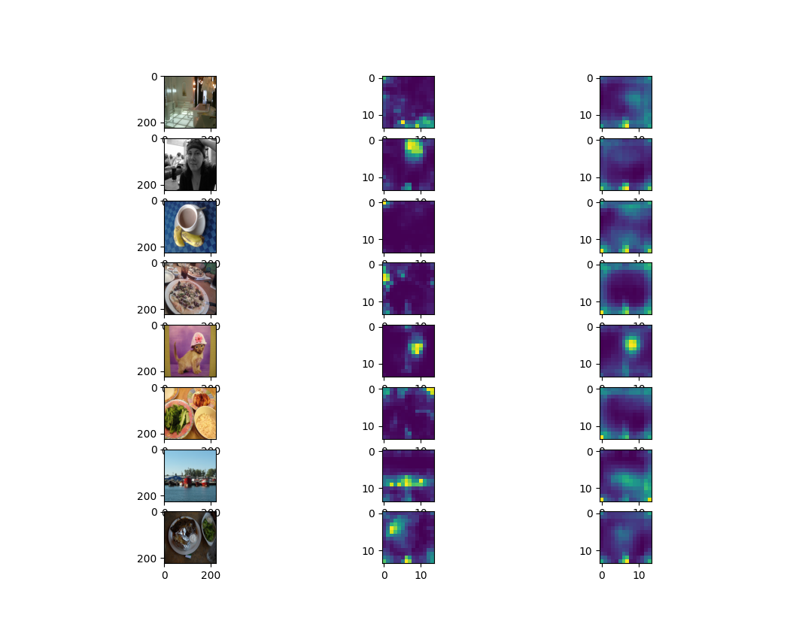
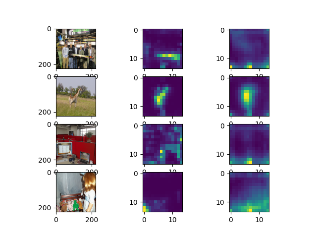
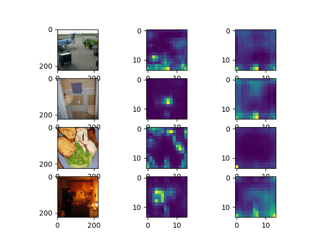

# Approach 1: Default rollout, transformer student 

## Files description

### Rollout related files

`vit_rollout.py` contains (modified by me) version of a transformer attention rollout. A modification was made so that rollout calculation can be performed on GPU, speeding up the training process significantly.

`old_rollout.py` contains original version of the transformer attention rollout.

`rollout_test.py` compares two versions mentioned above to ensure that each of them generates identical output.

### Dataset related files

`image_dataset.py` contains definition of the ImageDataset class, used to perform training. 

### Training related files

`config.py` specifies:

*  `teacher_model`, i.e. teacher model's architecture;
*  `student_model`, i e. student's architecture;
*  `student_out_dim`, representing dimensionality of the `CLS` token of the student
*  `dataset_path`, specifying a folder with images that will be used for training
*  `linear_layer_epochs`, specifying how many epochs should be spent with the base student model being frozen;
*  `ft_epochs`, specifying number of epochs when finetuning is being performed on the whole model 
*  `batch_size`, `lr`. During the second phase of training, learning rate is reduced ten times.
*  `downsamplig_strategy` -- either `MAE` or `DOWNSIZE`. The first one assumes that model will downsample the image on its own (like MAE models do, by masking); the second downsizes an image by `downsampling_factor` and then resizes it, achieving pixelation of the image.

`train.py` defines augmentations and models. It then starts training the model with transformer being frozen; after that, the transformer and linear layers are both unfrozen.

## Testing

`visualise_student.py` initializes models according to the configuration files (but the exact name of torch state file for a model to load is hardcoded in the file).

2 models are provided:

* `student-deit_tiny_distilled_patch16_224-epoch0-ft.pt`; DeiT architecture, initialised with pretrained weights. Had to predict based on pixelated images.

* `student-deit-trained-from-scrath_44.pt`, DeiT trained from scratch, with image size specified as 44 pixels. That meant that we could just downsize the image to 44 pixels (instead of pixelating it). Training a transformer from scratch doesn't seem to be worth it, though, as the model is significantly worse in every aspect.

Furthermore, a MAE was trained (but is not provided due to its size).

## Training protocol

For training, we've used images from the ImageNet validation set. There were 50000 of them.

1. After augmentation, an image was passed to the teacher model in order to perform the rollout calculation. Rollout was performed for a big DeiT, therefore we've used the discard ratio of 0.95 and averaged out values for attention heads.
2. Image was downsampled
3. Student model had to perform prediction (how would the rollout look like) based on that downsampled image.
4. Initially, initial layers of the student would be frozen (with only linear classifier unfrozen).
5. After that, the whole model was trained with reduced learning rate (1e-4 instead of 1e-3).

During training, we've only trained the model for 1 epoch (both during the first and second phase of training).

The impact of training the model on the entire ImageNet with a larger number of epochs remains to be seen.

## Results

All following examples come from the COCO dataset test set (meaning that the models probably didn't see them during training).

The middle image is an attention rollout for the teacher; on the right is our model's prediction of attention rollout.

### Pretrained DeiT 

### DeiT trained from scratch

